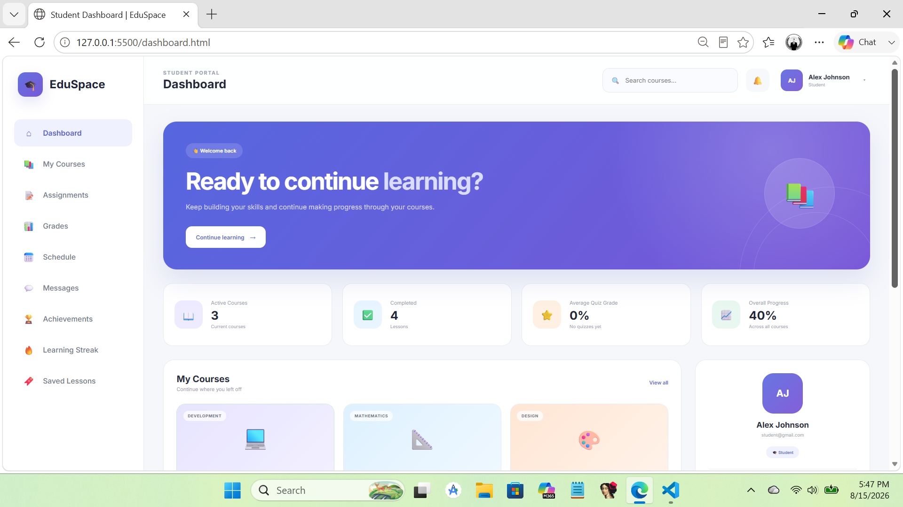

# 🎓 EduSpace — Student Learning Portal

A modern, responsive **student learning portal** built with vanilla **HTML, CSS, and JavaScript**. EduSpace brings courses, assignments, schedules, messages, learning progress, bookmarks, achievements, and profile tools into one clean student dashboard experience.

> **Project status:** Front-end prototype / portfolio project. Data and authentication are currently handled in the browser; no production backend is connected yet.


## ✨ Overview

EduSpace is a multi-page student portal designed to make everyday learning activities easy to access from one interface. Students can sign in to the demo, continue courses, review assignments, manage their schedule, save lessons, track study activity, view achievements, update profile information, and switch between appearance modes.

The project is built without a JavaScript framework or build system, making it easy to understand, customize, and deploy as a static website.

## 📸 Preview

Add your project screenshot to:

```text
docs/screenshots/dashboard.png
```

Then this image will appear automatically in the README:



> You can add more screenshots below for the login page, courses, assignments, schedule, profile, and mobile layout.

## 🚀 Features

- **Student login UI** with email validation, password validation, password visibility toggle, and loading feedback
- **Student dashboard** with courses, upcoming assignments, learning progress, notifications, and recent grades
- **Course library** for browsing available courses
- **Course lesson pages** with lesson content, progress, notes, materials, and quiz interactions
- **Assignments** with assignment details, requirements, materials, deadlines, and submission interactions
- **Schedule** with calendar-style organization and custom event support
- **Messages** interface for student conversations
- **Saved lessons / bookmarks** for keeping important lessons easy to find
- **Learning streak** tracking with activity summaries
- **Achievements** with progress and unlock states
- **Student profile** with personal, academic, and account sections
- **Avatar/profile picture** handling in the browser
- **Light, dark, and system theme preferences**
- **Responsive navigation and layouts** for desktop and smaller screens
- **Browser persistence** using `localStorage`

## 🛠️ Tech Stack

| Technology | Purpose |
| --- | --- |
| HTML5 | Page structure and semantic content |
| CSS3 | Styling, layouts, responsive design, themes, and animations |
| JavaScript | Interactivity, UI state, validation, course logic, and browser storage |
| localStorage | Demo persistence for preferences and student activity |
| Google Fonts | Inter typography |

## 📁 Project Structure

```text
WEBSITE/
├── index.html              # Student login
├── style.css               # Login page styling
├── script.js               # Login validation and demo sign-in
│
├── dashboard.html          # Student dashboard
├── dashboard.css
├── dashboard.js
│
├── courses.html            # Course library
├── courses.css
├── courses.js
│
├── course.html             # Individual course / lesson view
├── course.css
├── course.js
│
├── assignments.html        # Assignment management
├── assignments.css
├── assignments.js
│
├── schedule.html           # Student schedule
├── schedule.css
├── schedule.js
│
├── messages.html           # Messages
├── messages.css
├── messages.js
│
├── bookmarks.html          # Saved lessons
├── bookmarks.css
├── bookmarks.js
│
├── achievements.html       # Student achievements
├── achievements.css
├── achievements.js
│
├── streak.html             # Learning streak
├── streak.css
├── streak.js
│
├── profile.html            # Student profile
├── profile.css
├── profile.js
│
├── data.js                 # Shared demo course/assignment data
├── theme.js                # Light/dark/system theme logic
├── avatar.js               # Avatar/profile image logic
│
├── materials/              # Course/assignment material files
├── videos/                 # Local lesson videos
│   ├── css-basics.mp4
│   └── html-basics.mp4
│
├── docs/
│   └── screenshots/        # GitHub README screenshots
│
└── README.md
```

## ▶️ Getting Started

No npm install or build step is required.

### Option 1 — VS Code + Live Server

1. Download or clone the repository.
2. Open the project folder in **Visual Studio Code**.
3. Install the **Live Server** extension if you do not already have it.
4. Right-click `index.html`.
5. Select **Open with Live Server**.

### Option 2 — Python Local Server

From the project folder, run:

```bash
python -m http.server 5500
```

Then open:

```text
http://localhost:5500
```

## 🔐 Demo Login

The current login is a front-end demonstration.

- Enter any correctly formatted email address.
- Enter any password containing at least **6 characters**.
- Successful sign-in stores demo student information in the browser and redirects to the dashboard.

### Important Security Note

This project does **not** currently provide real authentication. Credentials are not verified by a server, and session state is stored using browser `localStorage`.

For a production application, replace the demo login with secure server-side authentication or a trusted authentication provider.

## 💾 Browser Storage

EduSpace uses `localStorage` to preserve parts of the demo experience, including login state, theme preferences, bookmarks, profile/avatar data, progress, assignments, achievements, and other UI state.

Because the data is stored locally in the browser:

- Data may differ between browsers or devices.
- Clearing browser storage can reset saved demo data.
- Browser storage should not be used for sensitive production data.

## 🖼️ Adding Screenshots to GitHub

Create this folder inside the project if it does not already exist:

```text
docs/screenshots/
```

Save your main screenshot as:

```text
docs/screenshots/dashboard.png
```

You can display an additional screenshot in this README with:

```md

```

## 🌐 Deploying with GitHub Pages

Because EduSpace is a static front-end project, it can be hosted directly with GitHub Pages.

1. Push the project to a GitHub repository.
2. Open the repository on GitHub.
3. Go to **Settings → Pages**.
4. Under **Build and deployment**, choose **Deploy from a branch**.
5. Select your default branch, usually `main`.
6. Select the `/ (root)` folder.
7. Save the configuration.
8. GitHub will provide the public site URL after deployment.

## 🗺️ Roadmap

Possible next steps for turning EduSpace into a full application:

- [ ] Connect a backend API
- [ ] Add real student authentication and authorization
- [ ] Add a database for users, courses, grades, assignments, and messages
- [ ] Add teacher and administrator dashboards
- [ ] Add secure file uploads for assignments
- [ ] Replace demo data with database/API data
- [ ] Add password reset and email verification
- [ ] Add automated testing
- [ ] Improve accessibility testing
- [ ] Convert the project into a PWA or mobile application

## 🤝 Contributing

Contributions, suggestions, and improvements are welcome. If you want to contribute:

1. Fork the repository.
2. Create a feature branch.
3. Make your changes.
4. Commit your work with a clear message.
5. Push the branch to your fork.
6. Open a pull request.

## 📄 License

No open-source license has been added yet. Before allowing others to reuse or redistribute the project, add a license that matches how you want the project to be used. The **MIT License** is a common choice for portfolio and open-source web projects.

## 👤 Author

Built as a student portal / learning dashboard project.

---

If you like this project, consider giving the repository a ⭐ on GitHub.

```
docs/screenshots/dashboard_1.png
docs/screenshots/dashboard_2.png
docs/screenshots/dashboard_3.png
docs/screenshots/dashboard_4.png
docs/screenshots/dashboard_5.png
docs/screenshots/dashboard_6.png
docs/screenshots/dashboard_7.png
docs/screenshots/dashboard_8.png
docs/screenshots/dashboard_9.png
docs/screenshots/dashboard_10.png
docs/screenshots/dashboard_11.png
docs/screenshots/dashboard_12.png
docs/screenshots/dashboard_13.png
docs/screenshots/dashboard_14.png
docs/screenshots/dashboard_15.png
```


